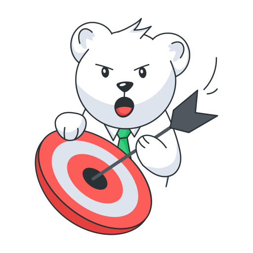

<!DOCTYPE html>
<html lang="en">

<head>
    <meta charset="UTF-8">
    <meta name="viewport" content="width=device-width, initial-scale=1.0">
    <title>Colorful Click Counter Game</title>

    
</head>

<body>
    

        

            

                
                <h1>Click Counter</h1>
            

            

                

                    
                    Score
                    0
                

                

                    
                    Resets
                    0
                

            

            

                <button id="click-button">⚡ Click to Score</button>
                <button id="reset-button">↺ Reset</button>
            

            

                
                Click the button to increase your score.
            

            

        

    

    
</body>

</html>
